<h1 align="center">
  
</h1>

  

  I build full-stack web apps and AI-powered tools — from RAG pipelines and LLM integrations to production-ready deployments.

  
  
  

  <a href="https://peewee-dev.vercel.app/sorting-hat">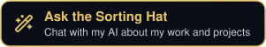</a>

---

## 🛠️ Tech Stack

<table>
<tr>
<td width="50%" valign="top">
<h4>Languages</h4>
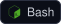
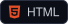
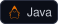
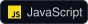
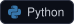
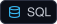
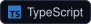
</td>
<td width="50%" valign="top">
<h4>AI &amp; Automation</h4>
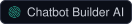
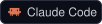
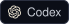
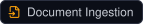
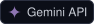
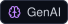
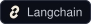
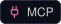
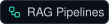
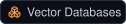
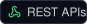
</td>
</tr>
<tr>
<td width="50%" valign="top">
<h4>Frameworks &amp; Libraries</h4>
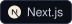
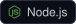
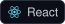
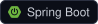
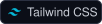
</td>
<td width="50%" valign="top">
<h4>Databases &amp; Cloud Platforms</h4>
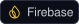
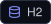
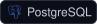
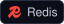
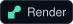

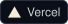
</td>
</tr>
<tr>
<td width="50%" valign="top">
<h4>Tools</h4>
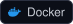
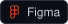
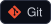
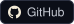
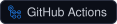
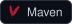
</td>
<td width="50%" valign="top">
<h4>Methodologies &amp; Practices</h4>
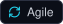
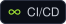
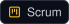
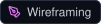
</td>
</tr>
</table>

## 📊 GitHub Stats

  
  

  

## 🐍 Contributions

<picture>
  <source media="(prefers-color-scheme: dark)" srcset="https://raw.githubusercontent.com/peewweee/peewweee/output/github-snake-dark.svg" />
  <source media="(prefers-color-scheme: light)" srcset="https://raw.githubusercontent.com/peewweee/peewweee/output/github-snake.svg" />
  
</picture>
